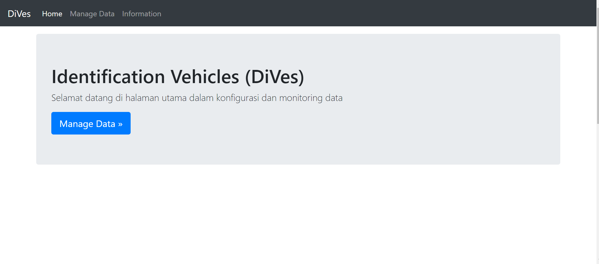
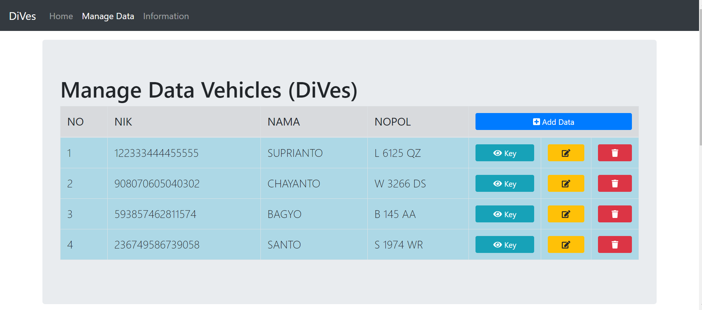
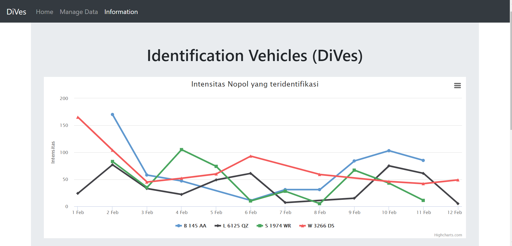
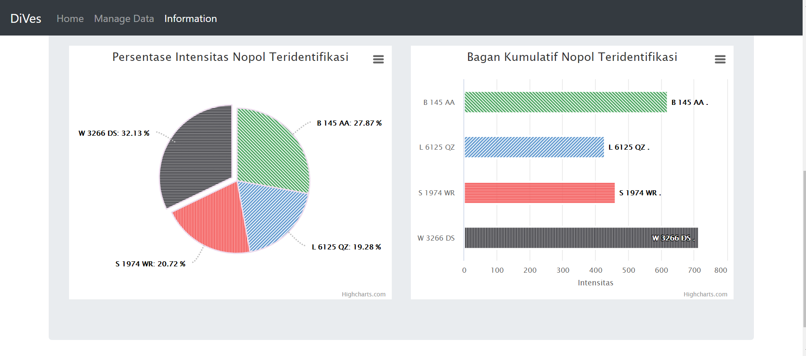

# Dives Web Base

Dives Web Base adalah Controller data dari konsep ***Identification Vehicle*** sebagai pengolah data menjadi informasi dan sebagai media ***First Install Device***. Berikut Fitur yang sudah ada
- [x] Manage Identitas Pengguna
- [x] Manage Identitas Kendaraan (Nopol, Nomor STNK, Dll.)
- [x] Bagan Informasi
- [x] Accessibility

## Requirement to Install
  - Bundle Packages you can install [XAMPP](https://www.apachefriends.org/download.html), or manually
  - Install PHP v7, mysql-server, Apache2

## How to Install
- [Clone](https://github.com/baysptr/dives-web.git) This Repo or [Download](https://github.com/baysptr/dives-web)
- Place it that to web root Apache, _(htdocs > WIN or /var/www/html > Linux)_
- Create database using CLI or PHPMyAdmin, by name ***dives***
- Import file ***DB.sql*** to newly created database
- Open your favorite browser, and write to URL column ***localhost/[your_folder_name]***
- If you want to use _Data Seeder_, you can write to URL column browser ***localhost/[your_folder_name]/seeder_monitoring.php***
- Enjoy!.

## Doc
Dashboard Dives

Manage Data Identitas User

Line, Bar and Pie Chart Information

